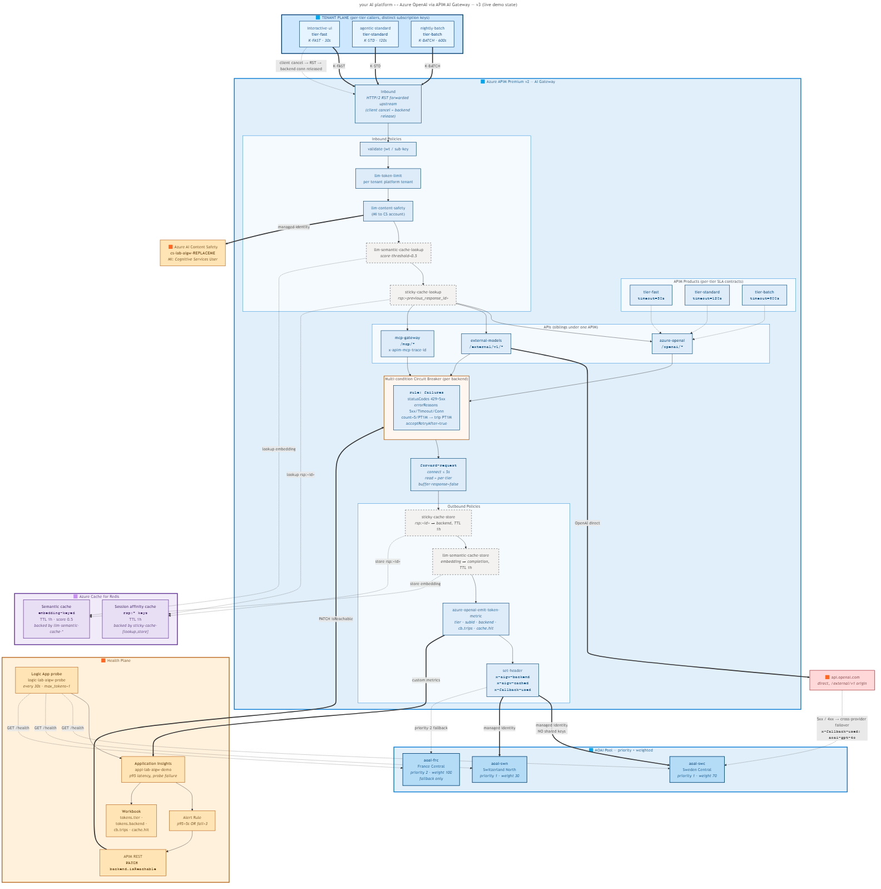

# APIM AI Gateway Lab

End-to-end, opinionated reference for using **Azure API Management** as a governance plane in front of **Azure OpenAI** and other model providers. Designed for teams that build a **GenAI platform for tenants**: BYO-key marketplaces, internal AI hubs, multi-tenant assistants, agent and MCP gateways.

The lab is **deployable in one command** (`scripts/deploy.ps1`) and **fully testable** end-to-end (`tests/test.ps1 -Scenario all`). Every governance feature ships with a **scenario test**, a **per-scenario diagram**, and a **walkthrough notebook section** explaining the policy, the trade-off, and the production posture.



---

## Why APIM as an AI gateway

If you run a generative-AI platform for tenants, you have to solve the same problems every time:

| # | Pain | Without a gateway | With APIM |
|---|---|---|---|
| A | Heterogeneous SLAs (chat 8s vs batch 600s) under one global timeout | Cancel valid long jobs **or** wait 10 min on dead chats | **Per-product `forward-request timeout`**: one Product per SLA class |
| B | Slow-fail (provider degraded but still 200) is not detected | Outages take hours to spot | **Multi-condition circuit breaker** + active health probe |
| C | Client cancels but the upstream model keeps generating (PTU/PAYG waste) | Pay for tokens nobody reads | **HTTP/2 RST propagation** with `buffer-response="false"` |
| D | Per-tenant routing logic lives in your proxy code | Forks of the gateway per tenant tier | **Tenant-class to Product mapping** in APIM |
| E | Prompt injection / jailbreaks reach the model | Token spend + data exfiltration risk | **`<llm-content-safety shield-prompt="true">`** blocks before forwarding |
| F | Token chargeback requires log parsing | Custom ETL per tenant | **`azure-openai-emit-token-metric`** with `subscription-id` dimension to App Insights |
| G | Streaming UX needed for assistants | Backend-buffered responses | **SSE pass-through** with `buffer-response="false"` |
| H | Stateful APIs (Responses API) need session affinity | Sessions break across regions | **External cache (Redis) for session lookup** |
| I | Same prompt asked twice, pay twice | Wasted tokens / latency | **`azure-openai-semantic-cache-lookup`** on embeddings |
| J | Beyond Azure OpenAI: external providers + MCP servers | Multiple bespoke gateways | **One APIM, multiple APIs** (`/openai`, `/external/v1`, `/mcp/*`) |
| K | APJ tenants hit a gateway in EU | 200-300ms wasted per call | **Self-hosted gateway** container in the tenant region |

The lab demonstrates **all 11** in code you can deploy, modify, and re-run.

---

## Repository layout

```
.
├── infra/                       # Bicep IaC, single-command deploy
│   ├── main.bicep
│   ├── modules/                 # APIM, AOAI, Redis, Content Safety, monitoring, workbook
│   ├── apim/                    # external-models + mcp-gateway APIs
│   └── policies/                # api-policy.xml, product-*.xml, external/mcp policies
├── notebooks/
│   ├── walkthrough.ipynb        # 18 sections: each pain, policy, test, diagram
│   ├── diagrams/                # 14 per-scenario PNGs (sequence + flow)
│   └── policies/                # standalone policy snippets used in the notebook
├── tests/
│   ├── test_gateway.py          # 12 live scenarios (Python)
│   └── test.ps1                 # PowerShell wrapper
├── scripts/
│   ├── deploy.ps1               # az login, quota check, bicep, write .demo.env
│   └── teardown.ps1             # delete RG (no-wait)
├── docs/
│   ├── demo-script.md           # 25-min talk track
│   ├── known-limitations.md     # gotchas, fallback narratives, prod tuning
│   └── diagrams/                # top-level reference architectures
└── .demo.env.example            # template; deploy.ps1 writes the real .demo.env
```

---

## Quick start

**Prereqs:**
- Azure subscription with quota for `OpenAI.Standard.gpt-4o` in **two** regions (default: Sweden Central + France Central + Switzerland North for the tertiary)
- `az` CLI 2.55+, `pwsh` 7+, `python` 3.10+, `pip install requests`
- Bicep CLI (bundled with `az`)

**Deploy + run tests:**

```pwsh
# 1. Provision (10-15 min, APIM is the long pole)
.\scripts\deploy.ps1 -ResourceGroup rg-aigw-lab -Location swedencentral

# 2. Run the full test suite against the live gateway
.\tests\test.ps1 -Scenario all

# 3. Open the walkthrough notebook (Jupyter / VS Code / GitHub preview)
code notebooks\walkthrough.ipynb

# 4. Tear down when done
.\scripts\teardown.ps1 -ResourceGroup rg-aigw-lab
```

**Test individual scenarios:**

```pwsh
.\tests\test.ps1 -Scenario baseline       # 200, headers visible
.\tests\test.ps1 -Scenario timeout-fast   # tier-fast forward-request cap trips
.\tests\test.ps1 -Scenario cb             # multi-condition circuit breaker (interactive)
.\tests\test.ps1 -Scenario cancel         # client-cancel propagation
.\tests\test.ps1 -Scenario stream         # SSE token streaming + TTFT
.\tests\test.ps1 -Scenario sticky         # Responses API two-step (Redis-backed)
.\tests\test.ps1 -Scenario cache          # semantic cache (embedding lookup)
.\tests\test.ps1 -Scenario safety         # content safety blocks unsafe prompt
.\tests\test.ps1 -Scenario jailbreak      # Prompt Shield blocks indirect injection
.\tests\test.ps1 -Scenario external       # cross-provider failover OpenAI to AOAI
.\tests\test.ps1 -Scenario mcp            # MCP gateway sibling API
```

---

## What you get

- **One APIM Premium v2** with managed identity to AOAI + Content Safety + Redis.
- **Three weighted AOAI backends** (3 regions) wired in a single backend pool.
- **Three APIM Products** (`tier-fast`, `tier-standard`, `tier-batch`) with per-tier forward-request timeouts and rate limits.
- **Three APIs**: `azure-openai` (chat + responses), `external-models` (OpenAI/Anthropic with AOAI fallback), `mcp-gateway` (Streamable HTTP MCP).
- **Application Insights workbook** with token/tenant/region tiles.
- **Bicep modules** you can lift into your own landing zone.

---

## Customising

- **Region pinning**: change `primaryLocation` / `secondaryLocation` / `tertiaryLocation` in `infra/main.bicep`.
- **Model**: `modelName` and `modelVersion` parameters; default is `gpt-4o` 2024-11-20.
- **More tenants and products**: see `notebooks/policies/tenant-products.bicep` for the per-tenant mapping pattern.
- **Self-hosted gateway**: out of scope for this lab. `notebooks/diagrams/14-shgw-singapore.png` shows the topology and `docs/known-limitations.md` lists the workshop ask.

---

## Contributing

Issues and PRs welcome. Run `tests/test.ps1 -Scenario all` against your fork before submitting.

## License

[MIT](LICENSE). Use it, fork it, ship it.
